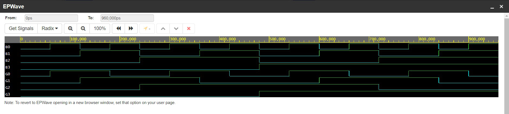

# CODE CONVERTER
## Binary to Gray Code Converter
* A Binary to Gray Code Converter is a tool or algorithm that facilitates the conversion of binary numbers to Gray code representation. The Gray code, also known as reflected binary code or the Gray code sequence, is a binary numeral system in which two consecutive values differ by only one bit.
* The conversion process from binary to Gray code involves applying a specific bitwise operation on the binary number. This process ensures that the adjacent Gray code values differ by only one bit, making it useful in various applications like digital communications, error detection and correction, and analog-to-digital converters.
 
## Gray to Binary Code Converter
* Converting a Gray code number back to its binary equivalent requires reversing the process used to convert binary to Gray code. The Gray code is designed in such a way that adjacent values differ by only one bit position, which makes it possible to convert Gray code back to binary through a straightforward algorithm.
 
## Output

   
  Binary to Gray Code Converter

 

   
  Gray to Binary Code Converter

